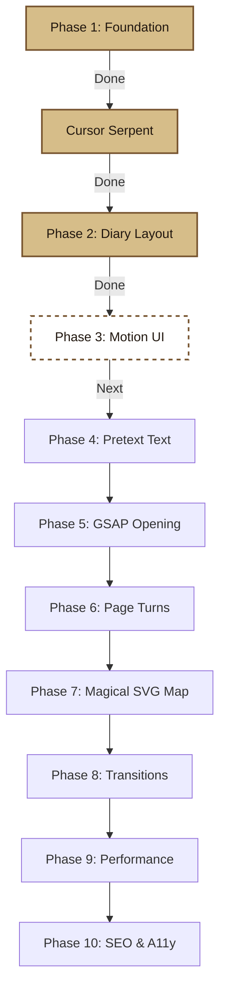

# Enchanted Diary Portfolio - Progress Tracker

This document tracks the step-by-step implementation progress of the Enchanted Diary Portfolio for **Ved Patil**.

---

## 🗺️ Roadmap Progress

---

## 🟢 Phase 1: Foundation (COMPLETED)
- [x] Create JSON structure (`src/data/content` & `src/data/config`)
- [x] Populate professional profile, projects, skills, education, and social configs
- [x] Create type definitions in `src/types/`
- [x] Integrate Google Fonts (`EB Garamond`, `IM Fell English SC`, `Caveat`) in `app/layout.tsx`
- [x] Set custom Tailwind `@theme` CSS tokens in `app/globals.css`
- [x] Verify foundation builds and passes linting checks

---

## 🟢 Interactive Cursor Serpent (COMPLETED)
- [x] Build custom SVG snake elements (python scaling body, head plates, stippling, glowing eyes, tongue, crossed scale patterns)
- [x] Implement optimized direct DOM updates inside a single `requestAnimationFrame` thread
- [x] Implement smooth delta-time-dependent angle slerping to prevent segment rotation jitter
- [x] Implement high-resolution path-history trailing coordinates with spacing constraint variables
- [x] Resolve React hydration mismatch warning using decimal scale rounding (`scale.toFixed(4)`)
- [x] Restructure drawing order rendering to draw Head explicitly last inside SVG DOM tree
- [x] Remove background fills to render transparent snake border illustrations

---

## 🟢 Phase 2: Static Diary Structure (COMPLETED)
- [x] Create `components/diary/Diary.tsx` container component
- [x] Create desktop double-page book layout frame (two-column parchment spread)
- [x] Create mobile single-column vertical scroll journal frame
- [x] Apply layered CSS background styling (WebP grain texture, leather border, edge shadow overlay, spine center crease)
- [x] Create basic routing navigation headers and footers

---

## 🟡 Phase 3: Standard Motion (UP NEXT)
- [ ] **Phase 3 — Standard Motion**: Basic fades, tooltips, success modal overlays

---

## ⚪ Phase 4 to 10: Remaining Roadmap Queue
- [ ] **Phase 4 — Pretext**: Ink handwriting animations, hero titles, interactive reflowing paragraphs
- [ ] **Phase 5 — GSAP Book Opening**: 3D cover scale rotation opening cinematics
- [ ] **Phase 6 — Page Turning**: Reusable 3D page turning transition loops
- [ ] **Phase 7 — Magical Map**: Interactive SVG castle map, secret trails, SVG footprint trails
- [ ] **Phase 8 — Cinematic Transitions**: Ink sweep screen transit wipes
- [ ] **Phase 9 — Performance**: Lighthouse optimizations, tab visibility throttling
- [ ] **Phase 10 — SEO & Accessibility**: Metadata details, sitemaps, JSON-LD schemas, keyboard controls
